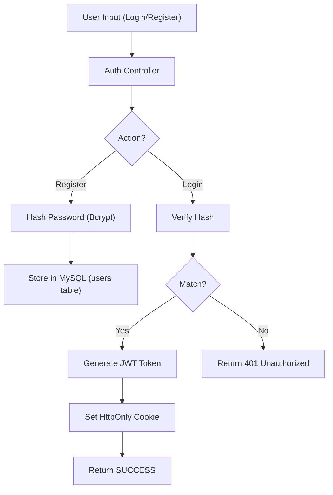

# Auth & Session Management

A secure authentication system for the Mansa ecosystem, utilizing **JSON Web Tokens (JWT)** and **HttpOnly Cookies** to manage user sessions and access levels. This module ensures that user data is protected against common attacks like XSS by restricting token access to the server-side.

Built to integrate seamlessly with the main database and provide granular permission control across all Mansa services.

## Usage
1. Environment configuration (`.env`):
   ```env
    #
    #$ DATABASE CONFIGURATION
    #
    MYSQL_USER=user
    MYSQL_PASSWORD=password
    MYSQL_HOST=localhost
    MYSQL_DATABASE=database

    #
    #$ AUTH SYSTEM
    #
    AUTH_ENABLED=TRUE
    AUTH_HOST=localhost
    AUTH_PORT=3200
    
    # Secret key for JWT signing
    JEW_TOKEN=your_super_secret_jwt_key
   ```

## Access Levels
The system uses a bit-flag style (or specific integer) level system to control permissions:

| Level | Name | Description |
| :--- | :--- | :--- |
| **00** | Free | Standard access to public data. |
| **01** | Developer | Access to generate and use API Keys. |
| **10** | Premium | Enhanced quotas and exclusive features. |
| **11** | Premium Developer | Combined benefits of both levels. |
| **67** | Admin | Full control over the system and user management. |

## API Endpoints

### Health Check
```bash
curl http://localhost:3200/auth/health
```
Returns service status.

### User Registration
Creates a new account with default access level `00`.
```bash
curl -X POST "http://localhost:3200/auth/register" \
     -H "Content-Type: application/json" \
     -d '{"username": "user", "email": "user@example.com", "password": "password123"}'
```

### User Login
Authenticates the user and initiates a session.
```bash
curl -X POST "http://localhost:3200/auth/login" \
     -H "Content-Type: application/json" \
     -d '{"username": "user", "password": "password123"}'
```
**Response Behavior:**
- Sets a `mansa_token` cookie (HttpOnly, Secure, SameSite=Lax).
- Returns a JSON object with `accessToken` (for manual header use) and user metadata.

### Profile (Me)
Retrieves the logged-in user's information.
```bash
curl -X GET "http://localhost:3200/auth/me" \
     -H "Authorization: Bearer YOUR_TOKEN"
```
*Note: Also works automatically via cookies in the browser.*

### Admin Access Test
Special route to verify Level 67 permissions.
```bash
curl -X GET "http://localhost:3200/auth/admin-only-test" \
     -H "Authorization: Bearer ADMIN_TOKEN"
```

## Security Features

- **Bcrypt Hashing**: All passwords are salted and hashed using the Blowfish algorithm (bcrypt) before storage.
- **Stateless Authentication**: JWT allows the server to verify users without storing session IDs in the database.
- **HttpOnly Cookies**: Prevents Cross-Site Scripting (XSS) from stealing session tokens via `document.cookie`.
- **Granular Permissions**: Level-based access control protecting critical routes like API Key generation.

## Workflow



## License
Mansa Team's MODIFIED GPL 3.0 License. See LICENSE for details.
