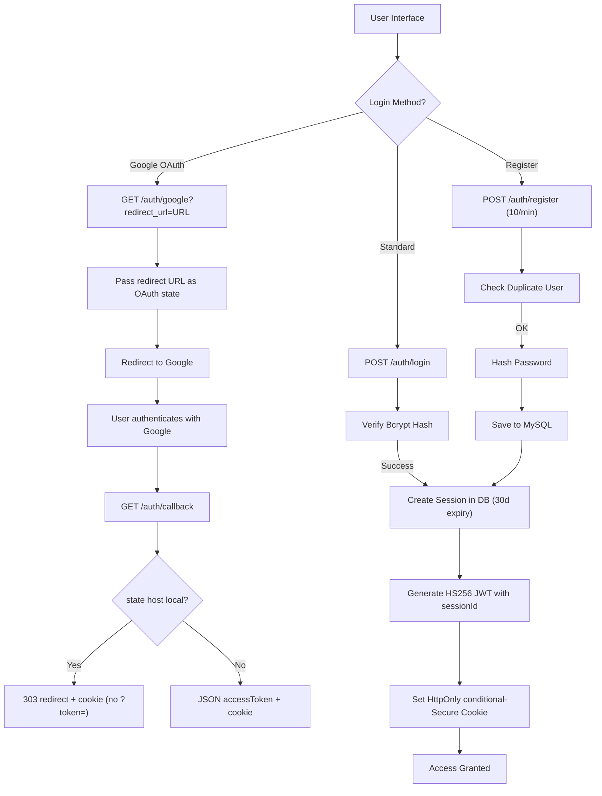

# Authentication Management

JWT (HS256) + HttpOnly cookie + DB-tracked sessions for the Mansa ecosystem (`USER` service, prefix `/auth`).

## Token & session lifetime

- Sessions and tokens live **30 days / 720 hours** (`main/app/authentication/constants.py:3-4`: `SESSION_EXPIRY_DAYS = 30`, `TOKEN_EXPIRY_HOURS = 720`).
- JWT payload: `{"userId", "sessionId", "exp"}`; signed HS256 with `Config.USER.JWT_SECRET_KEY` (`main/app/authentication/util.py:31-41`, verify `:44-51`).
- `SessionManager.createSession` defaults `expiresAt = now + 30d`; `validateSession` lazily deactivates expired rows (`main/app/authentication/session.py:32-65,126-144`).

## Token extraction order

`extractTokenPayload` (`main/app/authentication/util.py:54-62`) checks in this order:

1. `X-Access-Token` header
2. `Authorization: Bearer <token>`
3. `mansa_token` cookie

Missing token → 401 `Session not found`; expired → 401 `Token expired`; bad signature → 401 `Invalid token`.

## Cookie handling (conditional Secure)

`issueSessionCookie` (`main/controller/authentication_controller.py:45-62`):

- Cookie name `mansa_token`, path `/`, SameSite `lax`, HttpOnly.
- `Secure` is **conditional**: true only when the request is HTTPS — detected via `X-Forwarded-Proto` first, else `request.url.scheme` (`isSecureScheme`, `:28-37`).
- Domain via `resolveCookieDomain` (`:40-42`): `localhost` when host is `localhost`/`127.0.0.1`, otherwise the request hostname.
- Logout deletes the cookie with the same flags (`:141-149`) and revokes the DB session found in the token (`:128-139`).

## Session data model (family-only)

`UserSession` (`main/models/user_session.py:11-21`) stores **only**:

| Column | Source |
| :--- | :--- |
| `sessionId` / `userId` / `accessTokenHash` | generated at creation |
| `deviceType` | `desktop` / `mobile` / `tablet`, else `None` (family-only) |
| `browser` | `parsed.browser.family`, `None` if `Other` |
| `operatingSystem` | `parsed.os.family`, `None` if `Other` |
| `userAgent` | raw `User-Agent` header (may be `""`) |
| `isActive` / `createdAt` / `lastActivityAt` / `expiresAt` | lifecycle timestamps |

Parsing: `parseDeviceFields` (`main/app/authentication/session.py:13-27`, stored `:45-59`). There is **no** `browserVersion`, `osVersion`, `ipAddress`, `deviceName`, or fingerprint column — any doc claiming them is stale.

`updateLastActive` (`session.py:117-124`) exists but has **zero callers — dead / not wired**. `lastActivityAt` is set at creation and never refreshed.

## Roles and permissions

(`main/utils/roles.py:5-26` — note: there is **no** `DEVELOPER` role.)

| Role | Effective permissions |
| :--- | :--- |
| `USER` | none (`Permission.NONE`) |
| `PREMIUM` | `USE_PROMETHEUS` + `PROMETHEUS_EXTENDED_MEMORIES` |
| `DEVELOPER_STARTER` | = `USER` (no extra permissions) |
| `DEVELOPER_ENTERPRISE` | = `DEVELOPER_STARTER` (no extra permissions) |
| `ADMIN` | all (`Permission.ALL()`), bypasses checks |

Only two permissions exist: `USE_PROMETHEUS`, `PROMETHEUS_EXTENDED_MEMORIES`. There are no `VIEW_PROFILE` / `USE_THOTH` / `USE_MAAT` / `USE_OGUM` permissions — delete any such claims.

## Rate limits

(`main/controller/authentication_controller.py:71,101,154,172`)

| Endpoint | Limit |
| :--- | :--- |
| `POST /auth/register` | 10/minute |
| `POST /auth/login` | 10/minute |
| `GET /auth/google` | 5/minute |
| `GET /auth/callback` | 5/minute |

## API endpoints

### Health Check

```bash
curl http://localhost:3200/auth/health
```

### User Registration

Creates account (default role `USER`), then auto-logs in and sets the cookie.

```bash
curl -X POST "http://localhost:3200/auth/register" \
     -H "Content-Type: application/json" \
     -d '{"username": "user", "email": "user@example.com", "password": "password123"}'
```

Returns `{message, accessToken, tokenType: "bearer", user}` and sets `mansa_token`.

### User Login

```bash
curl -X POST "http://localhost:3200/auth/login" \
     -H "Content-Type: application/json" \
     -d '{"username": "user", "password": "password123"}'
```

Returns `{accessToken, tokenType: "bearer", user}` and sets `mansa_token`. Creates a new DB session per login (no session reuse).

### Logout

```bash
curl -X POST "http://localhost:3200/auth/logout" \
     -H "Authorization: Bearer YOUR_TOKEN"
```

Revokes the token's DB session (best-effort) and deletes the cookie. Always returns success even with no/invalid token.

### Google OAuth2 Login

```bash
# Browser redirect; redirect_url optional, else Referer header is used:
GET http://localhost:3200/auth/google?redirect_url=http://localhost:5500/main/test/auth.html
```

Passes `redirect_url` as the OAuth `state` param (`:166`).

### Google Callback (cookie-only)

Internal endpoint. Flow (`:173-222`):

1. Patches the `sso_state` cookie from the `state` query param (`:177-180`) as a SameSite workaround.
2. `verify_and_process`, syncs/creates the local user by Google id.
3. **Cookie-only redirect — no `?token=` in the URL.** If `state` is an `http(s)` URL whose host is in `LOCALHOST_ADDRESSES` or ends with `.localhost` (`:207-213`), returns `303 RedirectResponse` to it with the session cookie set (`:215-218`).
4. Otherwise (non-localhost or missing state) returns JSON `{accessToken, tokenType: "bearer", user}` with the cookie set (`:220-222`).

## Security features

- **Bcrypt hashing** (`util.py:14-28`) with empty-password guards.
- **Pre-insertion duplicate checks** on register to avoid id gaps.
- **Hybrid sessions**: stateless JWT carrying `sessionId`, revocable via DB row (`isActive` flag).
- **Conditional `Secure` cookies** (HTTPS-aware, proxy-aware).
- **OAuth state allowlist**: only localhost hosts accepted for redirect; anything else falls back to JSON (open-redirect guard).
- **CORS**: dynamic origin matching for trusted frontends.

## Not implemented

Password recovery, 2FA, and profile editing do not exist. The only user-surface reads are `GET /user/me`, `GET /user/admin`, and the `/user/sessions*` family (see `docs/user.md`).

## Workflow



## License

Mansa Team's MODIFIED GPL 3.0 License. See LICENSE for details.
