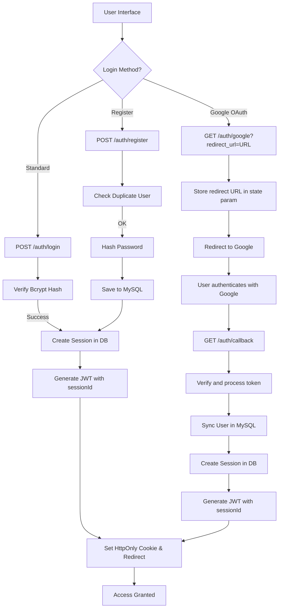

# Authentication Management

A secure authentication system for the Mansa ecosystem, utilizing **JSON Web Tokens (JWT)** and **HttpOnly Cookies** to manage user sessions and access levels. This module ensures that user data is protected against common attacks like XSS by restricting token access to the server-side.

Built to integrate seamlessly with the main database and provide granular permission control across all Mansa services.

**Note**: This system uses **fastapi-sso** for OAuth2 authentication, providing a standardized and secure OAuth flow.

## Usage
1. Environment configuration (`.env`):
   ```env
   #
   #$ DATABASE CONFIGURATION
   #
   USER_MYSQL_USER=user
   USER_MYSQL_PASSWORD=password
   USER_MYSQL_HOST=localhost
   USER_MYSQL_DATABASE=database

   #
   #$ AUTH SYSTEM
   #
   USER_ENABLED=TRUE
   USER_HOST=localhost
   USER_PORT=3200
   
   # Secret key for JWT signing
   JWT_SECRET_KEY=your_super_secret_jwt_key

   # Session secret key (for OAuth state management)
   SESSION_SECRET_KEY=your_session_secret_key

   # Google OAuth2
   GOOGLE_CLIENT.ID=your_id
   GOOGLE_CLIENT.SECRET=your_secret
   GOOGLE_REDIRECT.URI=http://localhost:3200/auth/callback
   ```

## Roles and Permissions
The system uses a string-based multi-role system to control access. Users can have one or more roles simultaneously, separated by commas in the database.

| Role | Name | Description |
| :--- | :--- | :--- |
| **USER** | Standard | Default access to basic features (Thoth and Ma'at). |
| **DEVELOPER** | Developer | Access to the developer tab and API Key generation. |
| **PREMIUM** | Premium | Access to all MUSA models and advanced algorithms. |
| **ADMIN** | Admin | Full control over the system (includes all roles). |

## API Endpoints

### Health Check
```bash
curl http://localhost:3200/auth/health
```
Returns service status.

### User Registration
Creates a new account with the default role `USER`.
```bash
curl -X POST "http://localhost:3200/auth/register" \
     -H "Content-Type: application/json" \
     -d '{"username": "user", "email": "user@example.com", "password": "password123"}'
```

### User Login
Authenticates the user and initiates a session.
```bash
curl -X POST "http://localhost:3200/auth/login" \
     -H "Content-Type: application/json" \
     -d '{"username": "user", "password": "password123"}'
```
**Response Behavior:**
- Sets a `mansa_token` cookie (HttpOnly, Secure, SameSite=Lax).
- Returns a JSON object with `accessToken`, user metadata, and a list of `roles`.
- Creates a new session in the database with device information.

### Profile (Me)
Retrieves the logged-in user's information and current roles.
```bash
curl -X GET "http://localhost:3200/auth/me" \
     -H "Authorization: Bearer YOUR_TOKEN"
```

### Logout
Logs out the user and revokes the current session.
```bash
curl -X POST "http://localhost:3200/auth/logout" \
     -H "Authorization: Bearer YOUR_TOKEN"
```
**Response Behavior:**
- Revokes the current session in the database.
- Deletes the authentication cookie.

### Google OAuth2 Login
Initiates the Google authentication flow.

**With custom redirect URL:**
```bash
# Redirect your browser to:
GET http://localhost:3200/auth/google?redirect_url=http://127.0.0.1:5500/main/test/auth.html
```

**Without redirect_url (uses Referer header):**
```bash
GET http://localhost:3200/auth/google
```

### Google Callback
Internal endpoint handled by the server. After successful Google login, it:
1. Verifies the user with Google using fastapi-sso.
2. Synchronizes the user with the local MySQL database.
3. Creates a session with device information.
4. Redirects to the frontend with the token in the URL query parameter:
   - Format: `http://127.0.0.1:5500/main/test/auth.html?token=ACCESS_TOKEN`
   - The token is also set as an HttpOnly cookie (`mansa_token`)

## Security Features

- **Bcrypt Hashing**: All passwords are salted and hashed using the Blowfish algorithm (bcrypt).
- **Auto-increment Gap Prevention**: The registration flow performs pre-insertion checks for existing usernames/emails to prevent database ID gaps on failed attempts.
- **Stateless Authentication**: JWT allows the server to verify users without session storage.
- **Hybrid Session Management**: JWT tokens include session IDs for tracking and revocation capabilities.
- **Device Detection**: Sessions include device fingerprinting (browser, OS, IP).
- **Session Revocation**: Users can revoke individual sessions or all sessions at once.
- **CORS Protection**: Configured with dynamic origin matching to allow authenticated requests from trusted frontends while maintaining security.
- **fastapi-sso**: OAuth2 flow handled by fastapi-sso library with built-in CSRF protection via state parameter.
- **OAuth State Parameter**: Redirect URL is passed via OAuth state parameter, not stored in session (avoids SameSite cookie issues).
- **HttpOnly Cookies**: Authentication tokens stored in HttpOnly cookies to prevent XSS attacks.

## Device Detection

The system automatically detects and stores device information for each session:

| Field | Description |
|-------|------------|
| browser | Detected browser (Chrome, Firefox, Safari, etc.) |
| browserVersion | Browser version |
| os | Operating system (Windows, macOS, Linux, Android, iOS) |
| osVersion | OS version |
| deviceType | Device category (desktop, mobile, tablet) |
| ipAddress | Client IP address |
| userAgent | Raw user agent string |

## Session Management

Sessions are tracked in the database and provide:
- **Device Fingerprinting**: Unique identifier based on User-Agent + IP
- **Session Listing**: View all active sessions
- **Session Revocation**: Revoke individual or all sessions
- **Automatic Expiration**: Sessions expire with JWT (24 hours)

See [User Documentation](user.md#session-management) for session management endpoints.

## Workflow



## License

Mansa Team's MODIFIED GPL 3.0 License. See LICENSE for details.