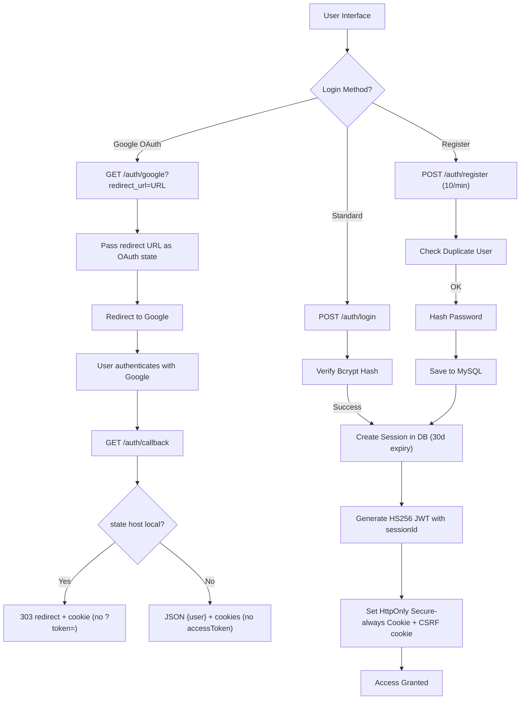

# Authentication Management

JWT (HS256) + HttpOnly cookie + DB-tracked sessions for the Mansa ecosystem (`USER` service, prefix `/auth`).

## Token & session lifetime

- Sessions and tokens live **30 days / 720 hours** (`main/app/authentication/constants.py:3-4`: `SESSION_EXPIRY_DAYS = 30`, `TOKEN_EXPIRY_HOURS = 720`).
- JWT payload: `{"userId", "sessionId", "exp"}`; signed HS256 with `Config.USER.JWT_SECRET_KEY` (`main/app/authentication/util.py:31-41`, verify `:44-51`).
- `SessionManager.createSession` defaults `expiresAt = now + 30d`; `validateSession` lazily deactivates expired rows (`main/app/authentication/session.py:32-65,126-144`).

## Token extraction order

`extractTokenPayload` (`main/app/authentication/util.py:54-62`) checks in this order:

1. `X-Access-Token` header
2. `Authorization: Bearer <token>`
3. `mansa_token` cookie

Missing token → 401 `Session not found`; expired → 401 `Token expired`; bad signature → 401 `Invalid token`.

## Cookie handling (Secure-always + HSTS + XFP-aware scheme)

`issueSessionCookie` (`main/controller/authentication_controller.py`):

- Cookie name `mansa_token`, path `/`, SameSite `lax`, HttpOnly, **`Secure` always**.
  Browsers send Secure cookies over https and over `http://localhost`
  (trustworthy loopback), so local dev keeps working while plain-LAN http
  can never carry the session. A spoofed `X-Forwarded-Proto: http` can never
  downgrade it (see `test_spoofed_forwarded_proto_http_keeps_secure`).
- Scheme detection trusts `X-Forwarded-Proto` first, else `request.url.scheme`
  (`getRequestScheme` in `main/utils/security_headers.py`; `isSecureScheme`
  wraps it). The scheme is used only for HSTS decisions, never for the
  cookie `Secure` flag.
- `Strict-Transport-Security: max-age=31536000; includeSubDomains` is set on
  every response whose (XFP-aware) scheme is https
  (`SecurityHeadersMiddleware`).
- Domain via `resolveCookieDomain`: host-only (no Domain attribute) when host
  is `localhost`/`127.0.0.1`, otherwise the request hostname.
- Logout deletes both `mansa_token` and `mansa_csrf` with the same flags and
  revokes the DB session found in the token (best-effort, always 200).
- CSRF: double-submit cookie `mansa_csrf` (readable by JS, Secure-always,
  SameSite `lax`) issued alongside the session + via `GET /auth/csrf`.
  Cookie-authenticated mutating requests must echo it in `X-CSRF-Token`
  (`CsrfProtectMiddleware`); header-only API calls (no session cookie) are
  exempt. Login/register/introspect/health are exempt (no session yet).
- Login/register/Google-callback are **cookie-only**: JSON returns
  `{message?, user}` with no `accessToken`/`tokenType`. Header bearer
  acceptance (`X-Access-Token` > `Authorization: Bearer` > cookie) is kept
  for non-browser API clients; browsers use the cookie + CSRF header.

## Session data model (family-only)

`UserSession` (`main/models/user_session.py:11-21`) stores **only**:

| Column | Source |
| :--- | :--- |
| `sessionId` / `userId` / `accessTokenHash` | generated at creation |
| `deviceType` | `desktop` / `mobile` / `tablet`, else `None` (family-only) |
| `browser` | `parsed.browser.family`, `None` if `Other` |
| `operatingSystem` | `parsed.os.family`, `None` if `Other` |
| `userAgent` | raw `User-Agent` header (may be `""`) |
| `isActive` / `createdAt` / `lastActivityAt` / `expiresAt` | lifecycle timestamps |

Parsing: `parseDeviceFields` (`main/app/authentication/session.py:13-27`, stored `:45-59`). There is **no** `browserVersion`, `osVersion`, `ipAddress`, `deviceName`, or fingerprint column — any doc claiming them is stale.

`updateLastActive` (`session.py:117-124`) exists but has **zero callers — dead / not wired**. `lastActivityAt` is set at creation and never refreshed.

## Roles and permissions

(`main/utils/roles.py:5-26` — note: there is **no** `DEVELOPER` role.)

| Role | Effective permissions |
| :--- | :--- |
| `USER` | `WALLET` — default on registration |
| `PREMIUM` | `WALLET` + `USE_ORUNMILA` + `ORUNMILA_EXTENDED_MEMORIES` |
| `DEVELOPER_STARTER` | = `USER` (no extra permissions) |
| `DEVELOPER_ENTERPRISE` | = `DEVELOPER_STARTER` (no extra permissions) |
| `ADMIN` | all (`Permission.ALL()`), bypasses checks |

Only three permissions exist: `USE_ORUNMILA`, `ORUNMILA_EXTENDED_MEMORIES`, `WALLET`. There are no `VIEW_PROFILE` / `USE_THOTH` / `USE_MAAT` / `USE_OGUM` permissions — delete any such claims.

## Rate limits

| Endpoint | Limit |
| :--- | :--- |
| `POST /auth/register` | 10/minute |
| `POST /auth/login` | 10/minute |
| `POST /auth/introspect` | 30/minute (requires `X-Service-Token`) |

## Service token (`POST /auth/introspect`)

Env (all optional except rotation needs `SECRET` set in prod):

```env
INTROSPECT_SERVICE_SECRET=<random-32B-base64>      # primary signing secret (independent from JWT_SECRET_KEY)
INTROSPECT_SERVICE_SECRET_PREV=<old-secret>         # previous secret during rotation, else empty
INTROSPECT_SERVICE_TTL_HOURS=720                    # minted token lifetime, default 30d
```

Mint: `python -c "from main.app.authentication.service_token import createServiceToken; print(createServiceToken())"`.
Send as `X-Service-Token: <jwt>`. Tokens carry `{"typ":"service","exp"}` and are
verified against `SECRET` then `PREV` (constant-time). Rotation: set
`PREV`=old, `SECRET`=new, re-mint callers, drop `PREV` after TTL. While
neither secret is configured the legacy static `HMAC(JWT_SECRET_KEY,
"auth-introspect")` is still accepted (migration window); configuring either
secret disables it.
| `GET /auth/google` | 5/minute |
| `GET /auth/callback` | 5/minute |

## API endpoints

### Health Check

```bash
curl http://localhost:3200/auth/health
```

### User Registration

Creates account (default role `USER`), then auto-logs in and sets the cookie.

```bash
curl -X POST "http://localhost:3200/auth/register" \
     -H "Content-Type: application/json" \
     -d '{"username": "user", "email": "user@example.com", "password": "password123"}'
```

Returns `{message, user}` (cookie-only, no `accessToken`) and sets `mansa_token` + `mansa_csrf`.

### User Login

```bash
curl -X POST "http://localhost:3200/auth/login" \
     -H "Content-Type: application/json" \
     -d '{"username": "user", "password": "password123"}'
```

Returns `{user}` (cookie-only, no `accessToken`) and sets `mansa_token` + `mansa_csrf`. Creates a new DB session per login (no session reuse).

### Logout

```bash
curl -X POST "http://localhost:3200/auth/logout" \
     -H "Authorization: Bearer YOUR_TOKEN"
```

Revokes the token's DB session (best-effort) and deletes the cookie. Always returns success even with no/invalid token.

### Google OAuth2 Login

```bash
# Browser redirect; redirect_url optional, else Referer header is used:
GET http://localhost:3200/auth/google?redirect_url=http://localhost:5500/main/test/auth.html
```

Passes `redirect_url` as the OAuth `state` param (`:166`).

### Google Callback (cookie-only)

Internal endpoint. Flow (`:173-222`):

1. Patches the `sso_state` cookie from the `state` query param (`:177-180`) as a SameSite workaround.
2. `verify_and_process`, syncs/creates the local user by Google id.
3. **Cookie-only redirect — no `?token=` in the URL.** If `state` is an `http(s)` URL whose host is in `LOCALHOST_ADDRESSES` or ends with `.localhost` (`:207-213`), returns `303 RedirectResponse` to it with the session cookie set (`:215-218`).
4. Otherwise (non-localhost or missing state) returns JSON `{user}` (cookie-only, no `accessToken`) with the cookies set.

## Security features

- **Bcrypt hashing** (`util.py:14-28`) with empty-password guards.
- **Pre-insertion duplicate checks** on register to avoid id gaps.
- **Hybrid sessions**: stateless JWT carrying `sessionId`, revocable via DB row (`isActive` flag).
- **Secure-always cookies** (never downgradable via `X-Forwarded-Proto` spoof) + **HSTS** on https responses.
- **Cookie-only login JSON** (no `accessToken` in bodies — closes XSS/sniff theft window; header bearer kept for non-browser API clients only).
- **Independent expiring service token** for `/introspect`: HS256 JWT `{"typ":"service","exp"}` signed with `INTROSPECT_SERVICE_SECRET` (never `JWT_SECRET_KEY`), `PREV` secret for rotation. Mint with `createServiceToken()` (`service_token.py`); rotation: set `PREV`=old, `SECRET`=new, re-mint, drop `PREV` after TTL. Legacy static HMAC is accepted only while neither secret is configured (migration window).
- **Double-submit CSRF** on cookie-authenticated mutations (`mansa_csrf` cookie + `X-CSRF-Token` header; `GET /auth/csrf` to refresh).
- **Auth-gated `/scraper/run`**: requires a valid session (`getCurrentUser`) even in `DEBUG_MODE`.
- **Flag-only UA/subnet anomaly**: `validateSession` logs UA-family changes + surfaces `sessionAnomaly` on `/user/me` — never rejects.
- **OAuth state allowlist**: only localhost hosts accepted for redirect; anything else falls back to JSON (open-redirect guard).
- **CORS**: dynamic origin matching for trusted frontends.

## Not implemented

Password recovery, 2FA, and profile editing do not exist. The only user-surface reads are `GET /user/me`, `GET /user/admin`, and the `/user/sessions*` family (see `docs/user.md`).

## Workflow


```mermaid
graph TD
    User["User Interface"] --> Start{Login Method?}

    Start -- Standard --> Login["POST /auth/login"]
    Login --> Verify["Verify Bcrypt Hash"]
    Verify -- Success --> CreateSession["Create Session in DB (30d expiry)"]
    CreateSession --> JWT["Generate HS256 JWT with sessionId"]

    Start -- Google OAuth --> GLogin["GET /auth/google?redirect_url=URL"]
    GLogin --> State["Pass redirect URL as OAuth state"]
    State --> GRedirect["Redirect to Google"]
    GRedirect --> GAuth["User authenticates with Google"]
    GAuth --> GCallback["GET /auth/callback"]
    GCallback --> Allowlist{"state host local?"}
    Allowlist -- Yes --> CookieRedirect["303 redirect + cookie (no ?token=)"]
    Allowlist -- No --> JSONFallback["JSON {user} + cookies (no accessToken)"]

    Start -- Register --> Reg["POST /auth/register (10/min)"]
    Reg --> Valid["Check Duplicate User"]
    Valid -- OK --> Hash["Hash Password"]
    Hash --> Save["Save to MySQL"]
    Save --> CreateSession

    JWT --> Cookie["Set HttpOnly Secure-always Cookie + CSRF cookie"]
    Cookie --> Home["Access Granted"]
```

## License

Mansa Team's MODIFIED GPL 3.0 License. See LICENSE for details.
