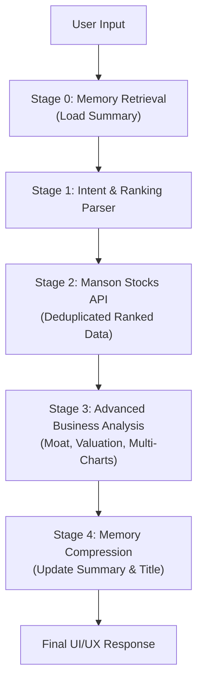

# Orunmila

O Orunmila é um agente chatbot focado no domínio financeiro, com acesso à carteira do usuário (sistema de carteira Iyagba/Thoth, em desenvolvimento), a dados financeiros (Stocks API) e a um sandbox para análises de computação estatística (ForgeVM), com um poderoso sistema de memória. Ele é a proposta de renomeação do Prometheus.

> Nota: os identificadores de código (env `PROMETHEUS_*`, rotas `/prometheus/*`, tabelas `prometheus`) permanecem inalterados até a renomeação posterior do código.

## Usage
1. Environment configuration (`.env`):
   ```env
    #
    #$ DATABASE CONFIGURATION
    #
    USER_MYSQL_USER=user
    USER_MYSQL_PASSWORD=password
    USER_MYSQL_HOST=localhost
    USER_MYSQL_DATABASE=database

    #
    #$ STOCKS API
    #
    STOCKSAPI_HOST=localhost
    STOCKSAPI_PORT=3200
    STOCKSAPI_PRIVATE.KEY=your_api_key_here

    #
    #$ PROMETHEUS
    #
    PROMETHEUS_ENABLED=TRUE

    PROMETHEUS_HOST=localhost
    PROMETHEUS_PORT=3201

    PROMETHEUS_KEY.SYSTEM=TRUE
    PROMETHEUS_PRIVATE.KEY=your_api_key_here

    GEMINI_API.KEY=your_api_key_here
   ```

2. Database Schema:
    The `prometheus` table should have the following structure:
    *   `sessionId`: String (PK)
    *   `userId`: Integer (FK to users)
    *   `title`: String (Max 255 chars)
    *   `summary`: Text (Technical Memory)
    *   `history`: JSON (Array of `{role, content, timestamp, metadata}`)
    *   `lastActivity`: Timestamp

3. Run the server:
    ```bash
    python __init__.py
    ```

## Workflow



## API Endpoints
*   `GET /prometheus/sessions`: List last 30 active sessions.
*   `POST /prometheus/sessions`: Create session.
*   `PUT /prometheus/sessions/{sessionId}`: Update session title (Rename).
*   `GET /prometheus/history/{sessionId}`: Retrieve ownership-protected history.
*   `POST /prometheus/chat`: Orchestrated workflow with memory persistence.

## License
Mansa Team's MODIFIED GPL 3.0 License. See LICENSE for details.
