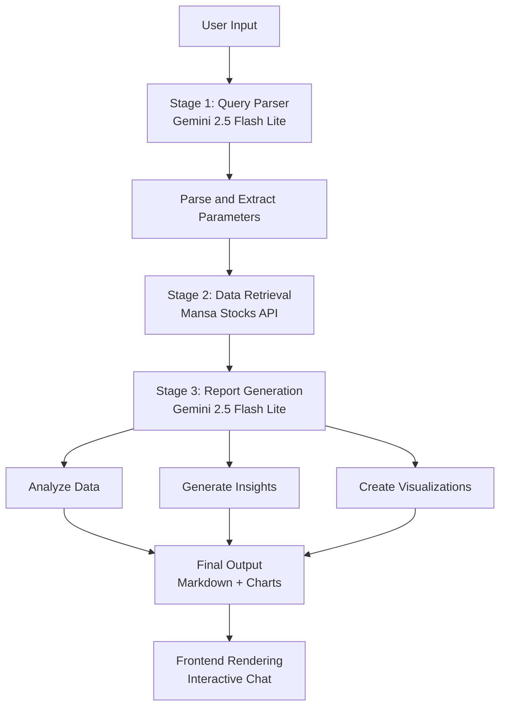

# Prometheus

A immersive chatbot using augmented generation techniques linked to the [Mansa's Stocks API](https://github.com/mansa-team/stocks-api) that generates in-depth, updated and trust-worthy data to help users manage their assets and investments, using an extensive workflow to generate responses using graphs, charts and etc.

With a full-on Chat History that can be integrated with the in-construction Mansa's main database and user data to provide the user a full chatbot experience inside our project that differs from just using normal chatbots like ChatGPT or Gemini, even tho the Large Language Model (LLM) used is Google's Gemini because of the use of exclusive and updated data on the Brazilian Stocks Market.

## Usage
1. Environment configuration (`.env`):
   ```env
    #
    #$ DATABASE CONFIGURATION
    #
    MYSQL_USER=user
    MYSQL_PASSWORD=password
    MYSQL_HOST=localhost
    MYSQL_DATABASE=database

    #
    #$ STOCKS API
    #
    STOCKSAPI_HOST=localhost
    STOCKSAPI_PORT=3200
    STOCKSAPI_PRIVATE.KEY=your_api_key_here

    #
    #$ PROMETHEUS
    #
    PROMETHEUS_ENABLED=TRUE

    PROMETHEUS_HOST=localhost
    PROMETHEUS_PORT=3201

    PROMETHEUS_KEY.SYSTEM=TRUE
    PROMETHEUS_PRIVATE.KEY=your_api_key_here

    GEMINI_API.KEY=your_api_key_here
   ```

4. Run the server:
    ```bash
    python src/__init__.py
    ```

## Workflow



## TODO
- [ ] CORS environment validation to prevent API requests outside the website
- [ ] Single initialization engine for the modules that depend on FastAPI, so I can have on port binded for all the modules (prob to be implemented in the server repository)

## License
Mansa Team's MODIFIED GPL 3.0 License. See LICENSE for details.