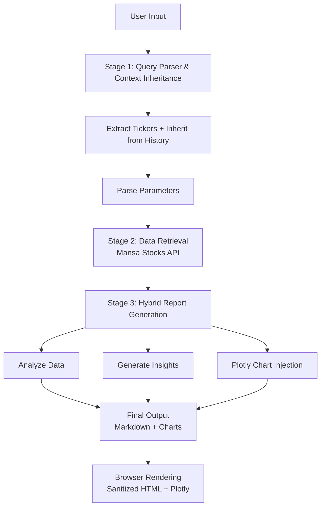

# Prometheus

A immersive chatbot using augmented generation techniques linked to the [Mansa's Stocks API](https://github.com/mansa-team/stocks-api) that generates in-depth, updated and trust-worthy data to help users manage their assets and investments, using an extensive workflow to generate responses using graphs, charts and etc.

### Optimized Persistence Model
The system uses a high-performance **Single-Table JSONB** architecture for chat history. Conversations are stored in the `prometheus` table, where the entire history is maintained in a single `JSON` column to minimize database joins and I/O latency.

### Security
*   **JWT Protected**: All endpoints require a valid JWT Bearer Token.
*   **Session Ownership**: Strict validation ensures users can only access their own `sessionId` via a verified `userId` lookup.

## Usage
1. Environment configuration (`.env`):
   ```env
    #
    #$ DATABASE CONFIGURATION
    #
    MYSQL_USER=user
    MYSQL_PASSWORD=password
    MYSQL_HOST=localhost
    MYSQL_DATABASE=database

    #
    #$ STOCKS API
    #
    STOCKSAPI_HOST=localhost
    STOCKSAPI_PORT=3200
    STOCKSAPI_PRIVATE.KEY=your_api_key_here

    #
    #$ PROMETHEUS
    #
    PROMETHEUS_ENABLED=TRUE

    PROMETHEUS_HOST=localhost
    PROMETHEUS_PORT=3201

    PROMETHEUS_KEY.SYSTEM=TRUE
    PROMETHEUS_PRIVATE.KEY=your_api_key_here

    GEMINI_API.KEY=your_api_key_here
   ```

2. Database Schema:
    The `prometheus` table should have the following structure:
    *   `sessionId`: String (PK)
    *   `userId`: Integer (FK to users)
    *   `title`: String
    *   `summary`: Text
    *   `history`: JSON (Array of `{role, content, timestamp, metadata}`)
    *   `lastActivity`: Timestamp

3. Run the server:
    ```bash
    python __init__.py
    ```

## Workflow


```mermaid
graph TD
    A["User Input"] --> B["Stage 1: Query Parser & Context Inheritance"]
    B --> B1["Extract Tickers + Inherit from History"]
    B1 --> C["Parse Parameters"]
    C --> E["Stage 2: Data Retrieval<br/>Mansa Stocks API"]
    E --> G["Stage 3: Hybrid Report Generation"]
    G --> H["Analyze Data"]
    G --> I["Generate Insights"]
    G --> J["Plotly Chart Injection"]
    H --> K["Final Output<br/>Markdown + Charts"]
    I --> K
    J --> K
    K --> L["Browser Rendering<br/>Sanitized HTML + Plotly"]
```

## API Endpoints
*   `GET /prometheus/sessions`: List last 30 active sessions for current user.
*   `POST /prometheus/sessions`: Create a new session.
*   `GET /prometheus/history/{sessionId}`: Retrieve full JSON history (Ownership protected).
*   `DELETE /prometheus/sessions/{sessionId}`: Remove a session.
*   `POST /prometheus/chat`: Send message and receive AI response with context persistence.

## License
Mansa Team's MODIFIED GPL 3.0 License. See LICENSE for details.