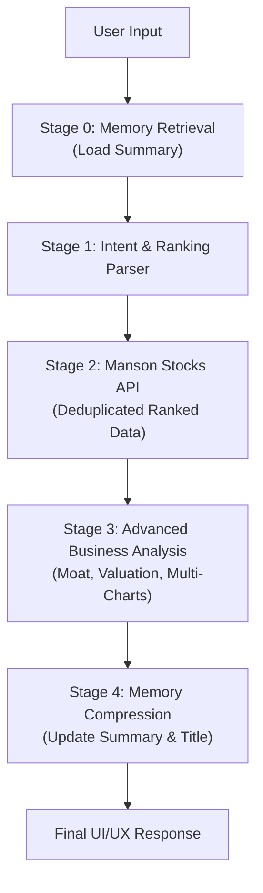

# Prometheus

A immersive chatbot using augmented generation techniques linked to the [Mansa's Stocks API](https://github.com/mansa-team/stocks-api) that generates in-depth, updated and trust-worthy data to help users manage their assets and investments, using an extensive workflow to generate responses using graphs, charts and etc.

### Memory & Persistence Architecture
The system utilizes a 4-Stage workflow powered by **Gemini 1.5 Flash** with long-term memory capabilities:

1.  **Stage 0 (Context Injection)**: Injects a persistent `summary` of the session's technical conclusions into the AI prompt to maintain continuity.
2.  **Stage 1 (Intent Analysis)**: Parses user natural language into structured API calls. Supports **Deduplicated Rankings** and automatic temporal adjustment (shifting current year to the last completed year).
3.  **Stage 4 (Session Management)**: Automatically updates the session `title` (max 50 tokens) and the session `summary` (technical memory) after each interaction to ensure the next prompt starts with full context.

### Security
*   **RBAC Protected**: Access to sessions is strictly limited to owners.
*   **JSONB History**: Conversations are stored in a single `history` column for high performance.
*   **Automatic Summarization**: Memory is compressed to preserve context within model token limits.

## Usage
1. Environment configuration (`.env`):
   ```env
    #
    #$ DATABASE CONFIGURATION
    #
    MYSQL_USER=user
    MYSQL_PASSWORD=password
    MYSQL_HOST=localhost
    MYSQL_DATABASE=database

    #
    #$ STOCKS API
    #
    STOCKSAPI_HOST=localhost
    STOCKSAPI_PORT=3200
    STOCKSAPI_PRIVATE.KEY=your_api_key_here

    #
    #$ PROMETHEUS
    #
    PROMETHEUS_ENABLED=TRUE

    PROMETHEUS_HOST=localhost
    PROMETHEUS_PORT=3201

    PROMETHEUS_KEY.SYSTEM=TRUE
    PROMETHEUS_PRIVATE.KEY=your_api_key_here

    GEMINI_API.KEY=your_api_key_here
   ```

2. Database Schema:
    The `prometheus` table should have the following structure:
    *   `sessionId`: String (PK)
    *   `userId`: Integer (FK to users)
    *   `title`: String (Max 255 chars)
    *   `summary`: Text (Technical Memory)
    *   `history`: JSON (Array of `{role, content, timestamp, metadata}`)
    *   `lastActivity`: Timestamp

3. Run the server:
    ```bash
    python __init__.py
    ```

## Workflow


```mermaid
graph TD
    A["User Input"] --> S0["Stage 0: Memory Retrieval<br/>(Load Summary)"]
    S0 --> B["Stage 1: Intent & Ranking Parser"]
    B --> C["Stage 2: Manson Stocks API<br/>(Deduplicated Ranked Data)"]
    C --> G["Stage 3: Advanced Business Analysis<br/>(Moat, Valuation, Multi-Charts)"]
    G --> S4["Stage 4: Memory Compression<br/>(Update Summary & Title)"]
    S4 --> K["Final UI/UX Response"]
```

## API Endpoints
*   `GET /prometheus/sessions`: List last 30 active sessions.
*   `POST /prometheus/sessions`: Create session.
*   `PUT /prometheus/sessions/{sessionId}`: Update session title (Rename).
*   `GET /prometheus/history/{sessionId}`: Retrieve ownership-protected history.
*   `POST /prometheus/chat`: Orchestrated workflow with memory persistence.

## License
Mansa Team's MODIFIED GPL 3.0 License. See LICENSE for details.