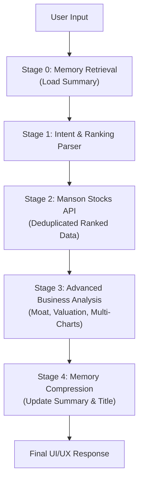

# Prometheus

O Prometheus é um ecossistema de conversação imersivo, projetado para atuar como um analista de investimentos inteligente e confiável. Ele utiliza técnicas avançadas de Geração Aumentada por Recuperação (RAG), conectando-se diretamente à Mansa's Stocks API para extrair dados fundamentalistas atualizados. Diferente de um chatbot comum, o Prometheus segue um fluxo de trabalho rigoroso de quatro estágios para garantir que as respostas não sejam apenas precisas, mas também baseadas em conclusões técnicas e persistentes.

A inteligência do sistema é movida pelo modelo Gemini 3.1 Flash Lite e Gemma 4 31B, mas o seu grande diferencial reside na nossa Arquitetura de Memória e Persistência. O ciclo de interação começa no Stage 0, onde o sistema injeta um resumo técnico das conclusões de sessões anteriores diretamente no prompt. Isso garante que a IA nunca "esqueça" o raciocínio financeiro desenvolvido com o usuário ao longo do tempo. No Stage 1, a linguagem natural do usuário é convertida em chamadas de API estruturadas, capazes de lidar com rankings deduplicados e ajustes temporais automáticos, garantindo que a análise reflita sempre o último ano fiscal completo.

Após o processamento dos dados e a análise de negócios (que inclui a avaliação de Moats e Valuation), o sistema encerra a interação no Stage 4. Nesta fase, o Prometheus realiza uma auto-manutenção da sessão: ele atualiza o título da conversa para algo conciso e gera um novo resumo técnico comprimido. Esse processo de sumarização automática é vital para preservar o contexto dentro dos limites de tokens do modelo, mantendo a alta performance e a continuidade do suporte decisório para o investidor. Tudo isso opera sob uma camada de segurança robusta, onde o acesso é protegido por regras de controle de acesso baseadas em funções (RBAC) e o histórico é armazenado em formato JSONB para máxima eficiência.

## Usage
1. Environment configuration (`.env`):
   ```env
    #
    #$ DATABASE CONFIGURATION
    #
    USER_MYSQL_USER=user
    USER_MYSQL_PASSWORD=password
    USER_MYSQL_HOST=localhost
    USER_MYSQL_DATABASE=database

    #
    #$ STOCKS API
    #
    STOCKSAPI_HOST=localhost
    STOCKSAPI_PORT=3200
    STOCKSAPI_PRIVATE.KEY=your_api_key_here

    #
    #$ PROMETHEUS
    #
    PROMETHEUS_ENABLED=TRUE

    PROMETHEUS_HOST=localhost
    PROMETHEUS_PORT=3201

    PROMETHEUS_KEY.SYSTEM=TRUE
    PROMETHEUS_PRIVATE.KEY=your_api_key_here

    GEMINI_API.KEY=your_api_key_here
   ```

2. Database Schema:
    The `prometheus` table should have the following structure:
    *   `sessionId`: String (PK)
    *   `userId`: Integer (FK to users)
    *   `title`: String (Max 255 chars)
    *   `summary`: Text (Technical Memory)
    *   `history`: JSON (Array of `{role, content, timestamp, metadata}`)
    *   `lastActivity`: Timestamp

3. Run the server:
    ```bash
    python __init__.py
    ```

## Workflow


```mermaid
graph TD
    A["User Input"] --> S0["Stage 0: Memory Retrieval<br/>(Load Summary)"]
    S0 --> B["Stage 1: Intent & Ranking Parser"]
    B --> C["Stage 2: Manson Stocks API<br/>(Deduplicated Ranked Data)"]
    C --> G["Stage 3: Advanced Business Analysis<br/>(Moat, Valuation, Multi-Charts)"]
    G --> S4["Stage 4: Memory Compression<br/>(Update Summary & Title)"]
    S4 --> K["Final UI/UX Response"]
```

## API Endpoints
*   `GET /prometheus/sessions`: List last 30 active sessions.
*   `POST /prometheus/sessions`: Create session.
*   `PUT /prometheus/sessions/{sessionId}`: Update session title (Rename).
*   `GET /prometheus/history/{sessionId}`: Retrieve ownership-protected history.
*   `POST /prometheus/chat`: Orchestrated workflow with memory persistence.

## License
Mansa Team's MODIFIED GPL 3.0 License. See LICENSE for details.