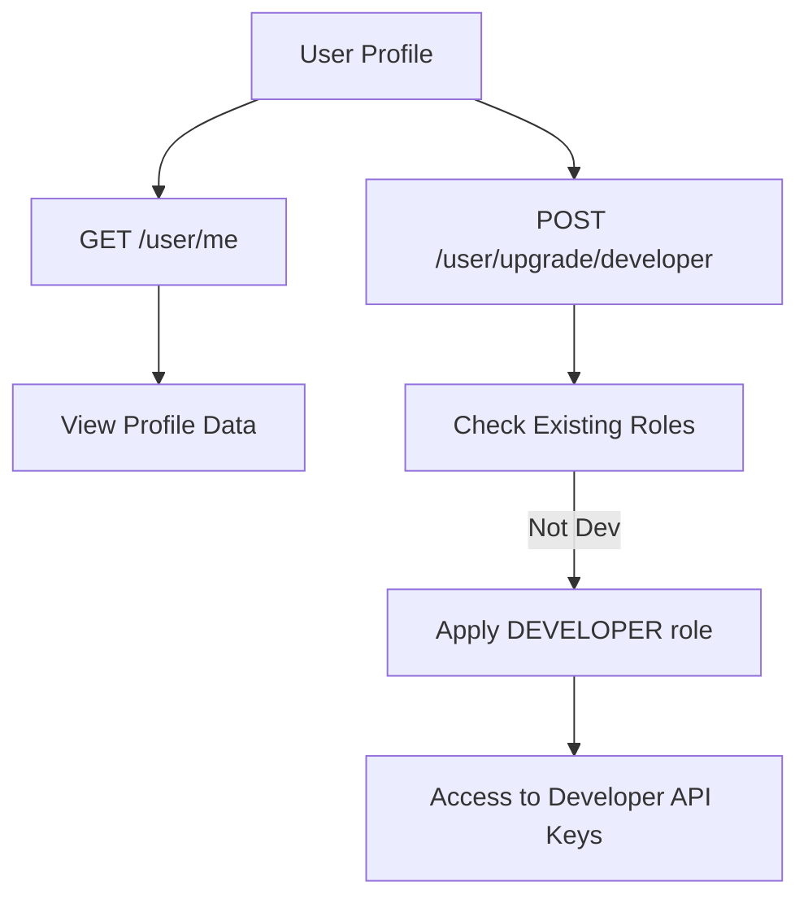

# User Management

Manage user profiles, role upgrades, and detailed user settings within the Mansa ecosystem. This module provides endpoints for users to view their own data and upgrade their status within the system.

## Roles and Permissions

The system uses a bitmask-based multi-role system to control access. Users can have multiple roles simultaneously.

| Role | Name | Description |
| :--- | :--- | :--- |
| **USER** | Standard | Default access to basic features (Thoth and Ma'at). |
| **DEVELOPER** | Developer | Access to the developer tab and API Key generation. |
| **PREMIUM** | Premium | Access to all MUSA models and advanced algorithms. |
| **ADMIN** | Admin | Full control over the system (includes all roles). |

## API Endpoints

### Health Check
```bash
curl http://localhost:3200/user/health
```
Returns user service status.

### Get Profile
Retrieve the currently authenticated user's information.
```bash
curl -H "Authorization: Bearer <token>" http://localhost:3200/user/me
```

### Upgrade to Developer
Grants the `DEVELOPER` role to the authenticated user.
```bash
curl -X POST -H "Authorization: Bearer <token>" http://localhost:3200/user/upgrade/developer
```

## Workflow



## License
Mansa Team's MODIFIED GPL 3.0 License. See LICENSE for details.
