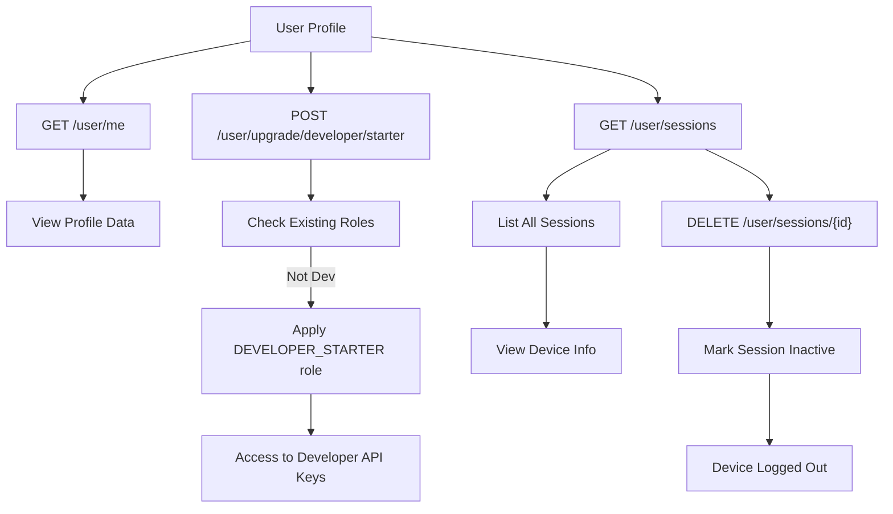

# User Management

Manage user profiles, role upgrades, and detailed user settings within the Mansa ecosystem. This module provides endpoints for users to view their own data, upgrade their status, and manage their sessions.

## Roles and Permissions

The system uses a string-based multi-role system to control access. Users can have multiple roles simultaneously.

| Role | Name | Description |
| :--- | :--- | :--- |
| **USER** | Standard | Default access to basic features (Thoth and Ma'at). |
| **PREMIUM** | Premium | Access to Prometheus and Ogum. |
| **DEVELOPER_STARTER** | Developer Starter | Access to developer tab and API Key generation. |
| **DEVELOPER_ENTERPRISE** | Developer Enterprise | Full API access, bulk exports, custom fields. |
| **ADMIN** | Admin | Full control over the system (includes all roles). |

## API Endpoints

### Health Check
```bash
curl http://localhost:3200/user/health
```
Returns user service status.

### Get Profile
Retrieve the currently authenticated user's information.
```bash
curl -H "Authorization: Bearer <token>" http://localhost:3200/user/me
```
**Response:**
```json
{
  "userId": 1,
  "username": "john",
  "email": "john@example.com",
  "roles": ["USER"],
  "sessionId": 5
}
```

### Upgrade to Developer Starter
Grants the `DEVELOPER_STARTER` role to the authenticated user.
```bash
curl -X POST -H "Authorization: Bearer <token>" http://localhost:3200/user/upgrade/developer/starter
```

### Upgrade to Developer Enterprise
Grants the `DEVELOPER_ENTERPRISE` role to the authenticated user.
```bash
curl -X POST -H "Authorization: Bearer <token>" http://localhost:3200/user/upgrade/developer/enterprise
```

### Admin Access
Test admin access (requires ADMIN role).
```bash
curl -H "Authorization: Bearer <token>" http://localhost:3200/user/admin
```

## Session Management

Manage user authentication sessions, view active devices, and revoke sessions.

### List All Sessions
View all active sessions for the current user.
```bash
curl -H "Authorization: Bearer <token>" http://localhost:3200/user/sessions
```
**Response:**
```json
{
  "sessions": [
    {
      "sessionId": 1,
      "deviceName": "Chrome on Windows 11",
      "browser": "Chrome",
      "browserVersion": "135",
      "os": "Windows",
      "osVersion": "11",
      "deviceType": "desktop",
      "ipAddress": "192.168.1.xxx",
      "lastActiveAt": "2026-04-20T10:30:00",
      "createdAt": "2026-04-20T10:00:00",
      "isActive": true,
      "isCurrent": false
    }
  ],
  "total": 2,
  "active": 2
}
```

### Get Current Session
Get details about the current active session.
```bash
curl -H "Authorization: Bearer <token>" http://localhost:3200/user/sessions/current
```
**Response:**
```json
{
  "sessionId": 1,
  "deviceName": "Chrome on Windows 11",
  "browser": "Chrome",
  "browserVersion": "135",
  "os": "Windows",
  "osVersion": "11",
  "deviceType": "desktop",
  "ipAddress": "192.168.1.100",
  "userAgent": "Mozilla/5.0 ...",
  "lastActiveAt": "2026-04-20T10:30:00",
  "createdAt": "2026-04-20T10:00:00"
}
```

### Revoke a Session
Revoke a specific session (logs out that device).
```bash
curl -X DELETE -H "Authorization: Bearer <token>" http://localhost:3200/user/sessions/1
```
**Response:**
```json
{
  "message": "Session revoked successfully",
  "sessionId": 1
}
```

### Revoke All Sessions
Log out from all devices except the current one.
```bash
curl -X POST -H "Authorization: Bearer <token>" http://localhost:3200/user/sessions/revoke-all
```
**Response:**
```json
{
  "message": "All sessions revoked successfully",
  "revokedCount": 3
}
```

## Permission System

Permissions are defined as bitmask flags:

```python
Permission.VIEW_PROFILE    # View own profile
Permission.USE_THOTH      # Use wallet management
Permission.USE_MAAT       # Use quantitative models
Permission.USE_PROMETHEUS # Use AI chat
Permission.USE_OGUM       # Use auto-trading
```

Roles combine multiple permissions:
- **USER**: VIEW_PROFILE | USE_THOTH | USE_MAAT
- **PREMIUM**: USER | USE_PROMETHEUS | USE_OGUM

## Workflow


```mermaid
graph TD
    User["User Profile"] --> Me["GET /user/me"]
    Me --> View["View Profile Data"]
    
    User --> Upgrade["POST /user/upgrade/developer/starter"]
    Upgrade --> Verify["Check Existing Roles"]
    Verify -- Not Dev --> Apply["Apply DEVELOPER_STARTER role"]
    Apply --> Success["Access to Developer API Keys"]
    
    User --> Sessions["GET /user/sessions"]
    Sessions --> ListSessions["List All Sessions"]
    ListSessions --> ViewDevice["View Device Info"]
    
    Sessions --> Revoke["DELETE /user/sessions/{id}"]
    Revoke --> MarkInactive["Mark Session Inactive"]
    MarkInactive --> LoggedOut["Device Logged Out"]
```

## License

Mansa Team's MODIFIED GPL 3.0 License. See LICENSE for details.