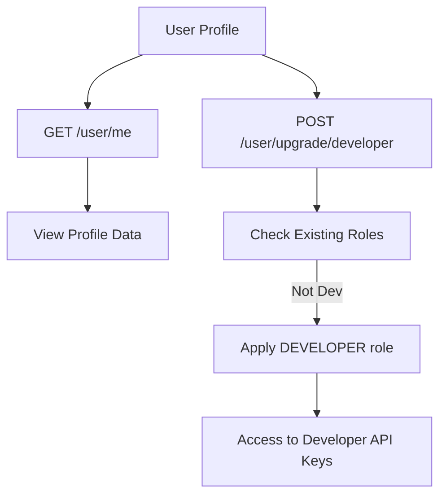

# User Management

Manage user profiles, role upgrades, and detailed user settings within the Mansa ecosystem. This module provides endpoints for users to view their own data and upgrade their status within the system.

## Roles and Permissions

The system uses a string-based multi-role system to control access. Users can have multiple roles simultaneously.

| Role | Name | Description |
| :--- | :--- | :--- |
| **USER** | Standard | Default access to basic features (Thoth and Ma'at). |
| **PREMIUM** | Premium | Access to Prometheus and Ogum. |
| **DEVELOPER_STARTER** | Developer Starter | Access to developer tab and API Key generation. |
| **DEVELOPER_ENTERPRISE** | Developer Enterprise | Full API access, bulk exports, custom fields. |
| **ADMIN** | Admin | Full control over the system (includes all roles). |

## API Endpoints

### Health Check
```bash
curl http://localhost:3200/user/health
```
Returns user service status.

### Get Profile
Retrieve the currently authenticated user's information.
```bash
curl -H "Authorization: Bearer <token>" http://localhost:3200/user/me
```

### Upgrade to Developer
Grants the `DEVELOPER_STARTER` role to the authenticated user.
```bash
curl -X POST -H "Authorization: Bearer <token>" http://localhost:3200/user/upgrade/developer
```

## Permission System

Permissions are defined as bitmask flags:

```python
Permission.VIEW_PROFILE    # View own profile
Permission.USE_THOTH      # Use wallet management
Permission.USE_MAAT       # Use quantitative models
Permission.USE_PROMETHEUS # Use AI chat
Permission.USE_OGUM       # Use auto-trading
```

Roles combine multiple permissions:
- **USER**: VIEW_PROFILE | USE_THOTH | USE_MAAT
- **PREMIUM**: USER | USE_PROMETHEUS | USE_OGUM

## Workflow


```mermaid
graph TD
    User["User Profile"] --> Me["GET /user/me"]
    Me --> View["View Profile Data"]
    
    User --> Upgrade["POST /user/upgrade/developer"]
    Upgrade --> Verify["Check Existing Roles"]
    Verify -- Not Dev --> Apply["Apply DEVELOPER role"]
    Apply --> Success["Access to Developer API Keys"]
```

## License

Mansa Team's MODIFIED GPL 3.0 License. See LICENSE for details.
