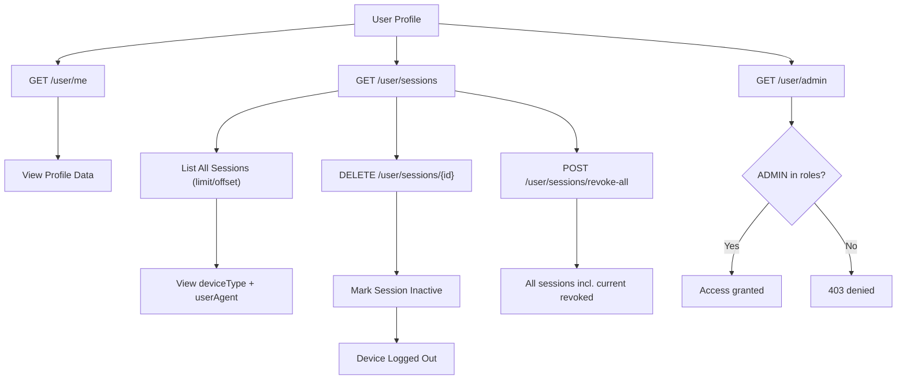

# User Management

Profile reads, role checks, and session management for the Mansa ecosystem (`USER` service, prefix `/user`). All endpoints require auth via `UserManager.getCurrentUser` (token order `X-Access-Token` > `Bearer` > cookie — see `docs/authentication.md`). **No rate limits on any `/user/*` route** (no `@limiter` in `main/controller/user_controller.py`).

## Roles and permissions

(`main/utils/roles.py:5-26` — note: there is **no** `DEVELOPER` role.)

| Role | Effective permissions |
| :--- | :--- |
| `USER` | none (`Permission.NONE`) — default on registration |
| `PREMIUM` | `USE_PROMETHEUS` + `PROMETHEUS_EXTENDED_MEMORIES` |
| `DEVELOPER_STARTER` | = `USER` (no extra permissions) |
| `DEVELOPER_ENTERPRISE` | = `DEVELOPER_STARTER` (no extra permissions) |
| `ADMIN` | all (`Permission.ALL()`), bypasses checks |

Only two permissions exist: `USE_PROMETHEUS`, `PROMETHEUS_EXTENDED_MEMORIES`. There are no `VIEW_PROFILE` / `USE_THOTH` / `USE_MAAT` / `USE_OGUM` permissions — delete any such claims. There are no role-upgrade endpoints in code; any `upgrade/developer/*` docs are stale.

## API endpoints

### Health Check

```bash
curl http://localhost:3200/user/health
```

Returns user service status. No auth.

### Get Profile

```bash
curl -H "Authorization: Bearer <token>" http://localhost:3200/user/me
```

Returns whatever `UserManager.getCurrentUser` yields (`{userId, username, email, roles, sessionId, ...}`).

### Admin Access

```bash
curl -H "Authorization: Bearer <token>" http://localhost:3200/user/admin
```

Returns `{message: "Admin access granted", user}` when `ADMIN` is in roles, else 403 `Admin access denied` (`main/controller/user_controller.py:38-43`).

## Session management

Sessions live **30 days** (`SESSION_EXPIRY_DAYS = 30`, `main/app/authentication/constants.py:3`). Each row stores **only** `sessionId`, `userId`, `accessTokenHash`, `deviceType`, `browser`, `operatingSystem`, `userAgent`, `isActive`, `createdAt`, `lastActivityAt`, `expiresAt` (`main/models/user_session.py:11-21`). Device fields are family-only (`None` when `user_agents` reports `Other`); there is **no** `browserVersion`, `osVersion`, `ipAddress`, `deviceName`, or fingerprint. `updateLastActive` (`main/app/authentication/session.py:117`) has zero callers — dead / not wired, so `lastActivityAt` never refreshes.

Serialized shape (`sessionToDict`, `main/controller/user_controller.py:16-25`): `sessionId`, `deviceType`, `lastActiveAt`, `createdAt`, `isActive`, `isCurrent`, `userAgent`. No `browser`/`operatingSystem` keys are returned (they exist in DB but are not serialized).

### List All Sessions

Paginated (`limit` default 20, max 100; `offset` default 0). Note: `limit`/`offset` apply in Python after fetching (up to 50 active rows via `getUserSessions`), not in SQL.

```bash
curl -H "Authorization: Bearer <token>" "http://localhost:3200/user/sessions?limit=20&offset=0"
```

```json
{
  "sessions": [
    {
      "sessionId": "abc...",
      "deviceType": "desktop",
      "lastActiveAt": "2026-04-20T10:30:00+00:00",
      "createdAt": "2026-04-20T10:00:00+00:00",
      "isActive": true,
      "isCurrent": true,
      "userAgent": "Mozilla/5.0 ..."
    }
  ],
  "total": 2,
  "active": 2,
  "limit": 20,
  "offset": 0
}
```

### Get Current Session

Most-recent active session by `lastActivityAt` (`getCurrentSession`). 404 `Current session not found` when none.

```bash
curl -H "Authorization: Bearer <token>" http://localhost:3200/user/sessions/current
```

Same object shape as list items (no `browser`/`operatingSystem`/`ipAddress` fields).

### Revoke a Session

```bash
curl -X DELETE -H "Authorization: Bearer <token>" http://localhost:3200/user/sessions/1
```

404 `Session not found` when the id is unknown or belongs to another user; else `{message: "Session revoked successfully", sessionId}`.

### Revoke All Sessions

Revokes **all** active sessions **including the current one** (`revokeAllSessions` has no exception for current).

```bash
curl -X POST -H "Authorization: Bearer <token>" http://localhost:3200/user/sessions/revoke-all
```

```json
{
  "message": "All sessions revoked successfully",
  "revokedCount": 3
}
```

## API keys (Stocks API)

One key per user. Table `stocksapi_keys` (`main/models/stocksapi_key.py:11-17`): `apiKey` (PK, `String(255)` — stores the **SHA-256 hex** of the key, never plaintext), `userId` (unique FK → `users.userId`, cascade delete), `requestLimit` (default 100), `currentUsage` (default 0), `lastReset`.

Verification (`main/app/stocks_api/key.py:17-48`):

- Bypassed entirely (returns `None`) when `Config.STOCKS_API.KEY_SYSTEM` is falsy.
- Client sends the raw key in the `X-API-Key` header (`APIKeyHeader(name="X-API-Key", auto_error=False)`).
- Usage is consumed with a single **atomic** `UPDATE ... SET currentUsage = currentUsage + 1 WHERE apiKey = :hash AND currentUsage < requestLimit` (`:27-32`) — no read-then-write race.
- `rowcount == 0` → re-query to distinguish: unknown hash → **401** `Invalid API key`; known but exhausted → **429** `quota exceeded`. Missing header → **401** `Missing API key`.

## Rate limits (related services)

For context — enforced in sibling controllers, not in `/user/*`:

| Scope | Endpoint | Limit |
| :--- | :--- | :--- |
| auth | `POST /auth/register`, `POST /auth/login` | 10/minute each |
| auth | `GET /auth/google`, `GET /auth/callback` | 5/minute each |
| prometheus | `POST /prometheus/chat/stream` | 5/minute |
| prometheus | `DELETE /prometheus/workspace/delete` | 30/minute |
| user | `/user/*` | unlimited |

## Not implemented

Password recovery, 2FA, and profile editing (no `PATCH /user/me` or equivalent) do not exist in `main/controller/user_controller.py:1-115`. The full route list is: `GET /user/health`, `GET /user/me`, `GET /user/admin`, `GET /user/sessions`, `GET /user/sessions/current`, `DELETE /user/sessions/{sessionId}`, `POST /user/sessions/revoke-all`.

## Workflow


```mermaid
graph TD
    User["User Profile"] --> Me["GET /user/me"]
    Me --> View["View Profile Data"]

    User --> Sessions["GET /user/sessions"]
    Sessions --> ListSessions["List All Sessions (limit/offset)"]
    ListSessions --> ViewDevice["View deviceType + userAgent"]

    Sessions --> Revoke["DELETE /user/sessions/{id}"]
    Revoke --> MarkInactive["Mark Session Inactive"]
    MarkInactive --> LoggedOut["Device Logged Out"]

    Sessions --> RevokeAll["POST /user/sessions/revoke-all"]
    RevokeAll --> AllOut["All sessions incl. current revoked"]

    User --> Admin["GET /user/admin"]
    Admin --> Check{"ADMIN in roles?"}
    Check -- Yes --> Granted["Access granted"]
    Check -- No --> Denied["403 denied"]
```

## License

Mansa Team's MODIFIED GPL 3.0 License. See LICENSE for details.
